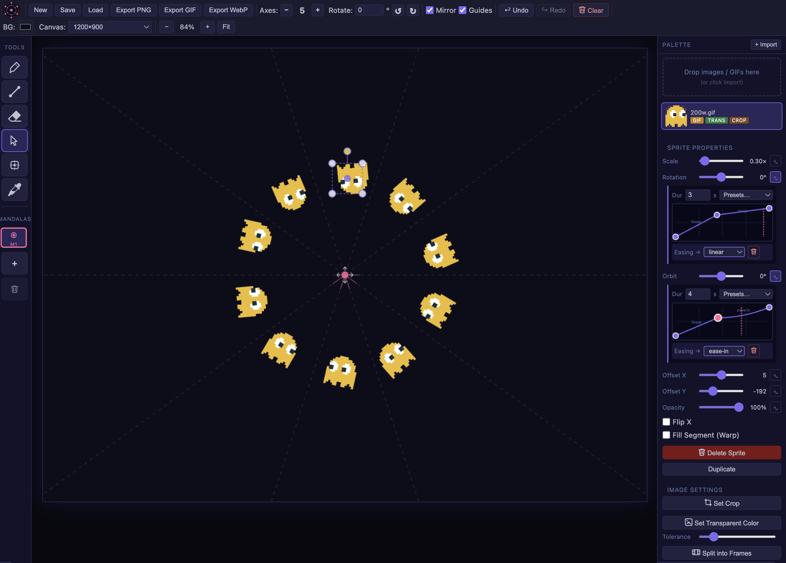

# Mandala Maker

A browser-based mandala drawing and compositing tool. Draw symmetrical art, stamp images, and compose layered mandalas with full radial symmetry, keyframe animation, and pan/zoom viewport.

---

## Getting Started

Open `index.html` in a browser, or serve it locally (e.g. `npx serve .`).

---

## Interface Overview

### Toolbar (top)

| Control | Description |
|---|---|
| **New / Save / Load** | Start fresh, save project as JSON, or load a saved project |
| **Export PNG** | Download the canvas as a PNG (guides and selection hidden) |
| **Axes −/+** | Set the number of symmetry axes (0 = free draw, no symmetry) |
| **Rotate ↺ ↻** | Step the axis rotation CCW or CW by `45°/n` per click |
| **Mirror** | Toggle kaleidoscope (mirrored, 2n copies) vs pinwheel (rotational, 2n rotations) |
| **Guides** | Show/hide the dashed symmetry guide lines |
| **Canvas** | Choose a canvas size preset or enter a custom W×H |
| **− / + / Fit** | Zoom out, zoom in, or fit canvas to screen |

### Sidebar (left)

| Tool | Key | Description |
|---|---|---|
| Brush | `B` | Freehand drawing with symmetry |
| Line | `L` | Straight line tool |
| Rectangle | — | Rectangle shape |
| Select | `S` | Select, move, scale, and rotate stamped sprites |
| Stamp | `P` | Place a palette image onto the canvas |
| Eyedropper | `I` | Pick a colour from the canvas |

### Mandalas Panel (bottom-left)

Each project can contain multiple mandalas stacked on the same canvas. Use **+** to add and the **trash** button to delete the active one (requires confirmation; the last mandala cannot be deleted).

### Palette (right)

Drag images or GIFs into the palette, or click **+ Import**. Select an image then switch to the Stamp tool to place it. Animated GIFs animate on the canvas.

---

## Symmetry System

Mandala Maker uses **dihedral symmetry**: `n` axes produce `2n` cells.

| Axes | Mirror ON | Mirror OFF |
|---|---|---|
| 1 | 2 copies (reflected across horizontal) | 2 rotational copies |
| 4 | 8 kaleidoscope copies | 8 pinwheel copies |
| 8 | 16 kaleidoscope copies | 16 pinwheel copies |

- **Mirror ON**: alternate copies are flipped — classic kaleidoscope look.
- **Mirror OFF**: all copies are pure rotations of the original — pinwheel look.

Guide lines always show `n` full lines through the centre (creating `2n` visual cells).

### Axis Rotation

The ↺ ↻ buttons rotate all axes by `45°/n` per click — one quarter of a cell width. You can also type a precise degree value in the number field.

---

## Stamp Tool

1. Select an image from the palette.
2. Press `P` or click the stamp icon.
3. Hover over the canvas to see a semi-transparent preview of all symmetry copies.
4. Click to place.
5. Press **Escape** to exit stamp mode, auto-switch to Select, and auto-select the last placed sprite for immediate adjustment.

### Sprite Properties (shown when a sprite is selected)

| Property | Description |
|---|---|
| **Scale** | Size multiplier |
| **Rotation** | Spin the sprite within each cell |
| **Orbit** | Rotate the sprite around the mandala centre |
| **Offset X / Y** | Nudge the sprite position |
| **Opacity** | Transparency |
| **Warp** | Bend the image to follow the arc at its radial distance |

Every property has an **animation button (∿)** — see Animation below.

---

## Animation

Each sprite property (Scale, Rotation, Orbit, Offset X/Y, Opacity) can be independently animated using a keyframe timeline:

1. Click the **∿** button next to a property slider to open its animation panel.
2. Set the **duration** (seconds per loop).
3. Choose a **preset** or drag the keyframe dots on the timeline to set values at specific times.
4. The **easing** dropdown controls the curve shape between each pair of keyframes.
5. Use the **bin** icon (visible only on non-endpoint keyframes) to delete a keyframe.
6. Animations loop continuously and are visible live in the canvas.

### Easing Options
`linear` · `ease` · `ease-in` · `ease-out` · `bounce` · `elastic`

### Presets (per property)
Each property ships with useful presets — e.g. Orbit defaults to **Orbit CW** (smooth continuous rotation using `linear` easing from −180° → 180°, which loops seamlessly).

---

## Warp Mode

When enabled on a sprite, Warp bends the image into an arc around the mandala origin:
- The drag handle sits at the arc centre for intuitive positioning.
- Scale, Orbit, and Offset X/Y all animate correctly in Warp mode.

---

## Canvas & Viewport

### Canvas Size Presets

| Category | Sizes |
|---|---|
| Square | 512, 800, 1024, 1440, 2048, 4096 |
| Landscape | 1200×900, 1280×720 (HD), 1920×1080 (FHD), 2560×1440 (QHD), 3840×2160 (4K) |
| Portrait | 900×1200, 1080×1920, 1242×2688 (Phone) |
| Custom | Enter any W×H up to 8192×8192 |

Resizing preserves the existing drawing.

### Pan & Zoom

| Action | Result |
|---|---|
| **Ctrl/⌘ + Scroll** | Zoom toward cursor |
| **Scroll** | Pan |
| **Space + drag** | Pan (grab cursor shown) |
| **Middle-mouse drag** | Pan |
| **Ctrl/⌘ +/−** | Zoom in/out |
| **Ctrl/⌘ 0** | Fit to screen |
| **Fit button** | Fit canvas to screen |
| **Double-click background** | Fit canvas to screen |

---

## Keyboard Shortcuts

| Key | Action |
|---|---|
| `B` | Brush tool |
| `L` | Line tool |
| `S` | Select tool |
| `P` | Stamp/Place tool |
| `I` | Eyedropper |
| `Escape` | Exit stamp mode → Select + select last stamp |
| `[` / `]` | Decrease / increase brush size |
| `Ctrl/⌘ Z` | Undo |
| `Ctrl/⌘ Y` | Redo |
| `Ctrl/⌘ S` | Save project |
| `Ctrl/⌘ +` / `-` | Zoom in / out |
| `Ctrl/⌘ 0` | Fit canvas to screen |
| `Space + drag` | Pan canvas |
| `Delete` / `Backspace` | Delete selected sprite |

---

## File Format

Projects save as `.json` (version 2) containing all mandala state: strokes, sprites (including animation keyframes), palette images as base64, canvas size, and background colour. The file is fully self-contained — no external assets needed.

Save/Load automatically includes every feature: animation keyframes, warp settings, orbit angles, tile layout, opacity, and all sprite properties.
