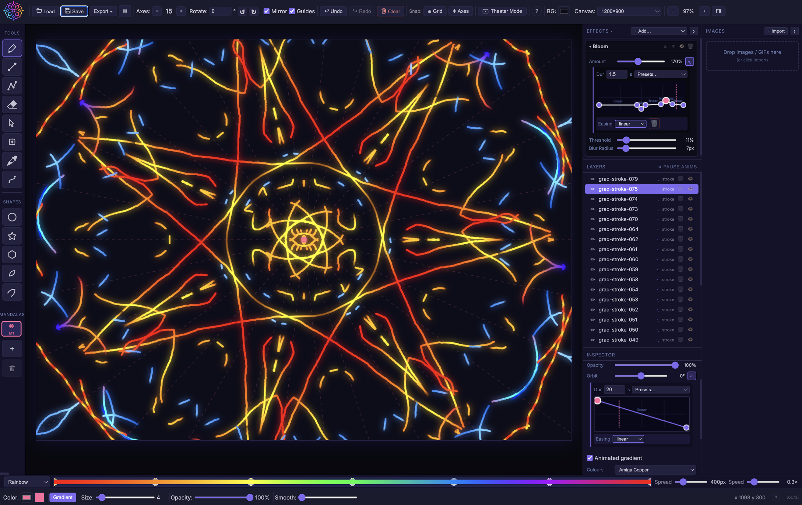

# Mandalize

### 🔗 [**Try it now at mandalize.net →**](https://www.mandalize.net)

No install, no login — just open the link and start drawing.

---

A free, browser-based animated mandala and kaleidoscope maker. Draw with radial symmetry, stamp images and animated GIFs, draw vector shapes, keyframe-animate anything, add a global stack of post-processing effects, and export as PNG, animated GIF/WebP, or video.

---

## Videos

| | |
|---|---|
| **[Post Effects](videos/PostEffects.mp4)** | A tour of the Effects panel — Bloom, Echo, Chromatic Aberration, Vignette, Zoom Blur, Hue Rotate, Scanlines and Invert Flash, layered and animated. |
| **[Neon Dreams](videos/NeonDreams.mp4)** | An animated mandala built from gradient strokes, keyframed shapes and sprites. |
| **[Thomas' Eye](videos/ThomasEye.mp4)** | Vector shapes (Petal/Bezier/Wing) combined with image stamping. |
| **[Thomas & Orchid](videos/ThomasOrchid.mp4)** | Radial image stamping with orbit and warp animation. |

(GitHub doesn't preview local `.mp4` files inline — click through to view/download.)

---

## Getting Started

Just open **[mandalize.net](https://www.mandalize.net)** — nothing to install.

To run this repo locally instead: open `index.html` directly in a browser, or serve it (e.g. `npx serve .`). It's a static site with no build step.

---

## Feature Overview

### Symmetry

Mandalize uses **dihedral symmetry**: setting the axis count to `n` produces `2n` repeated copies of everything drawn or placed. **Mirror** toggles between a kaleidoscope look (alternating copies flipped) and a pinwheel look (all copies pure rotations). Axis rotation, guide lines, and radial/tangential snapping are all independently configurable, and a single project can hold multiple mandalas layered on the same canvas.

### Drawing & Shapes

- **Brush** — freehand drawing, smoothed and repeated with radial symmetry, with optional animated colour gradients.
- **Line** — click to place the start, click again to finish.
- **Line Chain** — the same click flow as Line, but each finished segment immediately starts the next, chaining a whole polyline.
- **Vector shapes** — Circle, Star, Polygon, Petal, Bezier and Wing, each with fill, stroke (dash/cap/join), and gradient options. Wing mirrors a second arm across the axis running from its tip to the mandala's centre.
- **Fading trail animation** — any stroke can become a comet-like sweeping trail instead of a static line, including a continuous-chase mode.

### Images, Sprites & GIFs

Drag in images or animated GIFs/WebPs, stamp them with full radial symmetry, and independently animate each stamped copy's Scale, Rotation, Orbit, Offset and Opacity. Supports sprite sheets, colour-key transparency, cropping, and warping a stamped image into a circular arc.

### Keyframe Animation

Every animatable property gets a looping keyframe timeline with per-segment easing (linear, ease, ease-in, ease-out, bounce, elastic) and ready-made presets. Position animation is split into **Radial** (in/out along the axis spoke) and **Tangential** (side-to-side around the ring) rather than raw X/Y, so the two never drift into each other.

### Effects

A global, ordered stack of post-processing effects applied to the whole canvas every frame and on export — Bloom, Echo, Chromatic Aberration, Vignette, Zoom Blur, Hue Rotate, Scanlines and Invert Flash — each independently animatable.

### Touch

Two-finger pinch-to-zoom and pan on tablets and phones, the same gesture as a map app.

### Exporting

PNG stills, seamlessly-looping animated GIF/WebP, and MP4/WebM video with ready-made size presets for Instagram, TikTok, YouTube Shorts, Twitter/X and Pinterest.

### Saving

Save writes the entire project — every mandala, all strokes/shapes/sprites, every animation keyframe, and embedded palette images — to a single self-contained `.json` file. Load reads it back exactly as it was.

---

## Full Documentation

See **[mandalize.net/help](https://www.mandalize.net/help/)** for the complete feature guide and keyboard shortcut reference.
